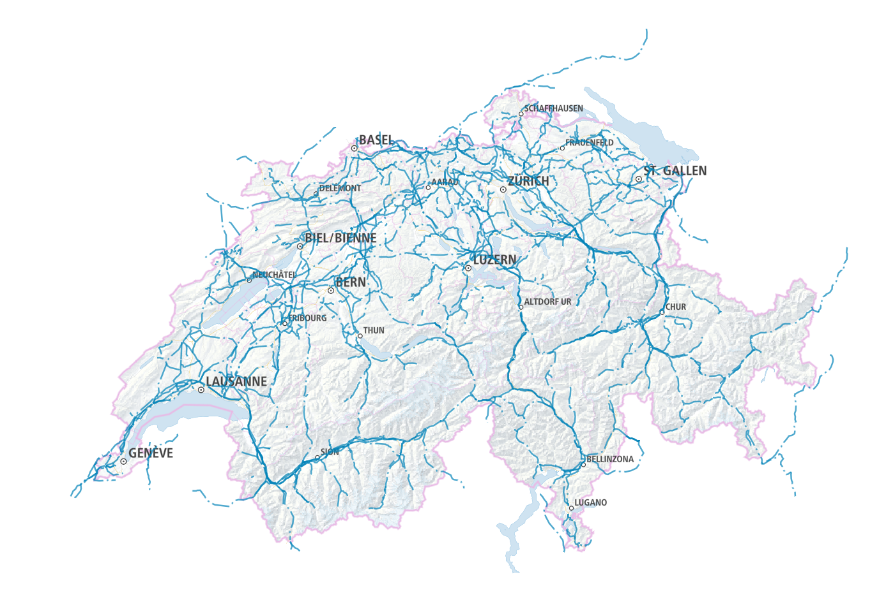

# declarative-powerlines-switzerland
Map of powerlines in Switzerland built with Planetiler's declarative schema approach and PMTiles

This is the same map as https://github.com/wipfli/powerlines-switzerland but this time we use Planetiler's declarative schema approach.

More about delarative schemas in Planetiler:

* README: https://github.com/onthegomap/planetiler/tree/main/planetiler-custommap
* Examples: https://github.com/onthegomap/planetiler/tree/main/planetiler-custommap/src/main/resources/samples

[Demo](https://wipfli.github.io/declarative-powerlines-switzerland/)

<a href="https://wipfli.github.io/declarative-powerlines-switzerland">
    
</a>

## Generate tiles

Clone this repo:

```
git clone git@github.com:wipfli/declarative-powerlines-switzerland.git
cd declarative-powerlines-switzerland
```

Run Planetiler:

```
docker run -v "$(pwd)/data":/data ghcr.io/onthegomap/planetiler:latest generate-custom --schema=/data/power.yml --download
```

This will download about 1 GB of assets from natural earth, geofabrik, and other sources.

Install PMTiles python package:

```
pip3 install pmtiles
```

Convert `data/output.mbtiles` to `output.pmtiles`:

```
pmtiles-convert data/output.mbtiles output.pmtiles
```
